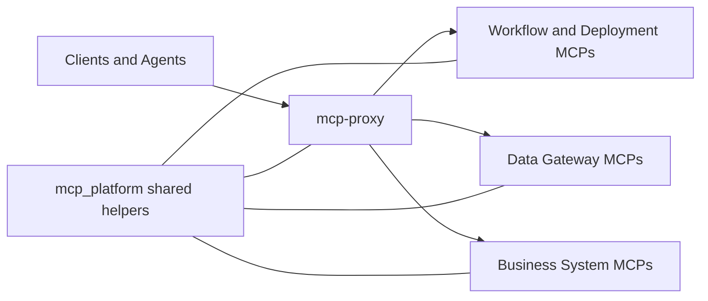

# MCP Proxy V2

Production-oriented MCP platform for connecting AI agents to operational systems through a single secure gateway.

This repository contains a multi-service Model Context Protocol stack built around a central proxy plus a set of modular MCP servers for workflows, data access, operations, CRM, finance, and support tooling. The code was originally developed for internal automation use, but the architecture is broadly reusable for teams building secure AI integrations against many back-end systems.



## About This Project

- Multi-service MCP architecture with a unified gateway for tools, prompts, and resources
- Secure AI tool orchestration with role-aware access control and write protection
- Cloud-native deployment patterns using FastAPI, Cloud Run, Firestore, and Secret Manager
- Standardized tool contracts and response envelopes across heterogeneous connectors
- Agent guidance patterns such as bootstrap instructions, skill catalogs, help resources, and guarded workflows

## Architecture Overview

At a high level, the platform is organized as:

1. Clients and agents connect to a single MCP endpoint exposed by `mcp-proxy`
2. The proxy authenticates the caller, resolves permissions, and routes requests to upstream MCP services
3. Specialized MCP servers expose domain-specific tools for automation, databases, support systems, financial systems, and operational workflows
4. Shared protocol helpers in `mcp_platform` keep tool behavior, envelopes, and pagination patterns consistent across services

```text
Clients / Agents
				|
				v
	+-------------+
	|  mcp-proxy  |
	+-------------+
		|    |    |
		|    |    +-----------------> workflow / deployment services
		|    +----------------------> data and document services
		+---------------------------> business system connectors
```

## Key Capabilities

### Unified MCP Gateway

The proxy aggregates multiple upstream MCP servers behind a single endpoint. This simplifies client setup while preserving modular service boundaries.

### Security and Guardrails

The platform includes multiple layers of protection:

- API-key and token-based authentication
- Per-user and per-service permissions
- Read/write classification for sensitive tools
- Cloud IAM and secret-backed upstream credentials
- Audit logging and usage tracking
- Validation hooks before high-impact actions

### Modular Connector Design

Each top-level `*-mcp` directory is an independent MCP service focused on one integration area. Examples include:

- workflow automation
- SQL and document access
- CRM and support systems
- payment and accounting systems
- field operations and scheduling

This separation keeps each connector deployable and testable on its own while still allowing centralized orchestration through the proxy.

### Agent Enablement

The repository also includes agent-facing building blocks such as:

- skill catalogs
- prompt resources
- tool-specific help content
- standardized error payloads
- workflow safety guidance

These patterns are useful when building reliable AI systems that need more than raw tool access.

## Repository Structure

- `mcp-proxy/`: central gateway, auth, permissions, admin API, skill catalog, web UI
- `mcp_platform/`: shared protocol helpers used across MCP services
- `*-mcp/`: modular connector services for specific domains and systems
- `sql-gateway/`: read-only SQL access with validation and paging helpers
- `firestore-gateway/`: constrained Firestore access patterns for agent tooling
- `contract_tests/`: cross-service tests for tool contracts and consistency
- `scripts/`: utility scripts for local development and platform maintenance

Some directory names reflect the concrete systems these connectors were built against. The public framing in this README intentionally abstracts away tenant-specific or internal business context while preserving the real engineering structure.

## Tech Stack

- Python 3.11
- FastAPI
- FastMCP / MCP server patterns
- Firestore
- Google Cloud Run
- Google Secret Manager
- TypeScript / Vite for the proxy admin UI

## Local Development

This is a monorepo-style platform repository. Each service manages its own runtime dependencies.

Typical workflow:

1. Choose a service directory such as `mcp-proxy/`, `n8n-mcp/`, or `sql-gateway/`
2. Create a virtual environment in that service
3. Install dependencies from `requirements.txt` or `pyproject.toml`
4. Run the service's `main.py` or documented start command
5. Use the service-specific README for environment variables and deployment details

## Why It Matters

This project showcases practical AI infrastructure work beyond simple model prompts. It demonstrates how to:

- design a protocol gateway for many back-end systems
- enforce security boundaries around AI-driven actions
- build reusable integration layers for agents
- standardize contracts across independent services
- ship cloud-ready developer tooling with operational safeguards

## Note on Context

This public copy intentionally presents the system as a reusable AI integration platform rather than documenting its original internal business use in detail. The code remains representative of the actual architecture and implementation patterns.
